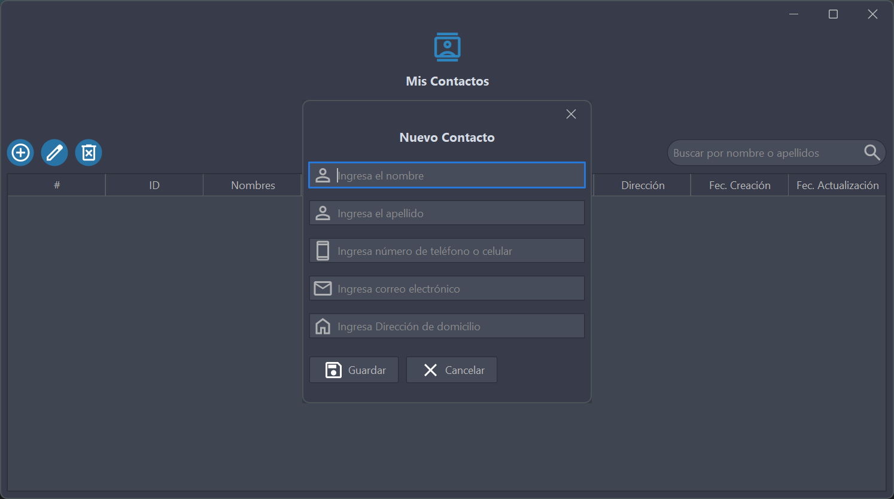

# Administrador de Contactos

   

## Descripción

Es una aplicación de escritorio desarrollada en **Java** con **Swing** para la interfaz gráfica. La aplicación consume una **API REST** desarrollada con **Spring Boot**, utilizando **MySQL** como base de datos para el almacenamiento de los contactos. 

Para mejorar la experiencia visual, se ha implementado **[FlatLaf](https://www.formdev.com/flatlaf/)**, un framework de personalización para Swing, y **[Google Material Icons](https://fonts.google.com/icons)** para los iconos de la interfaz.

  
*Ejemplo de la interfaz de usuario de la aplicación.*

## Características
- Interfaz gráfica con diseño mejorado utilizando **FlatLaf**.
- Gestión de contactos con operaciones **CRUD**.
- Consumo de una **API REST** en **Spring Boot**.
- Almacenamiento en **MySQL**.
- Uso de **Google Material Icons** para iconografía.

## Requisitos

Antes de ejecutar el proyecto, asegúrate de contar con los siguientes componentes:

- **Java 17** o superior (para la aplicación de escritorio)
- **Java 23** (para la API REST)
- **Maven** (para gestionar dependencias)
- **MySQL Server**
- **Spring Boot** (para la API REST)

## Instalación y Ejecución
### 1. Clonar el Repositorio
```sh
git clone https://github.com/raufjavedev/contact-manager.git
```

### 2. Configurar la Base de Datos
1. Iniciar **MySQL Server**.
2. Crear la base de datos:
   ```sql
   CREATE DATABASE nombre_de_base_de_datos;
   ```
3. Configurar las credenciales en el archivo `application.properties` de la API REST.

### 3. Clonar y Ejecutar la API REST
El proyecto requiere una API REST alojada en otro repositorio. Clona y ejecuta la API antes de iniciar la aplicación de escritorio:
```sh
git clone https://github.com/raufjavedev/contact-manager-api.git
```
Repositorio de la API REST: **[API Gestión de Contactos](https://github.com/raufjavedev/contact-manager-api)**

1. Asegúrate de tener **Java 23** instalado y configurado correctamente.
2. Compila y ejecuta la API con Maven:
   ```sh
   mvn spring-boot:run
   ```

### 4. Ejecutar la Aplicación de Escritorio
1. Importe el proyecto en IntelliJ IDEA, Eclipse o en el editor de su preferencia.
2. Compilar y ejecutar la clase principal `Main.java`.

## Tecnologías y Recursos Utilizados

El proyecto utiliza diversas tecnologías y recursos externos:

- **Java 23** - Lenguaje de programación principal para la aplicación de escritorio y la API REST.
- **Swing** - Librería para la interfaz gráfica.
- **FlatLaf** - Framework de personalización de interfaces en Swing. Más detalles en su **[repositorio oficial](https://github.com/JFormDesigner/FlatLaf)**.
- **Spring Boot** - Framework para la creación de la API REST.
- **MySQL** - Sistema de gestión de bases de datos.
- **Google Material Icons** - Conjunto de iconos disponibles en **[Google Fonts](https://fonts.google.com/icons)**.

## Licencia 
Este proyecto está bajo la licencia **Apache 2.0**. Para más detalles, consulta el archivo `LICENSE`.

